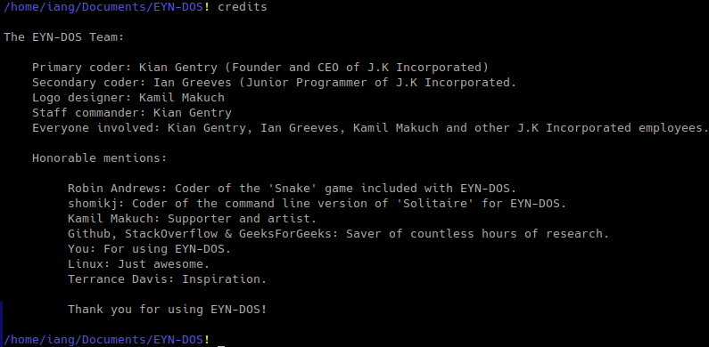
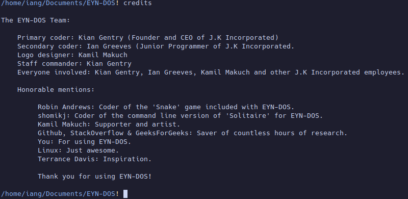

# Welcome to the EYN-DOS Instruction Manual! 

---

This manual will go through crucial information regarding the use of EYN-DOS and everything included with the version of EYN-DOS we will be discussing today (2.6).

---

---

Installation:
---

Firstly, make sure to install all modules needed for EYN-DOS before attempting runtime. The modules required are as follows: Colorama, Shutil, Pillow (PIL), Requests, DateTime, and TermColor. Install these via the "pip" package manager included with Python, or using your systems package manager to install the modules (Typically in the format of 'python-modulename').
After this, run "main.py" after first extracting the EYN-DOS '.zip' file to your desired location (or after cloning the GitHub repository using the web URL). This will write to the Bash and Batch scripts (eyn.sh, eyn.bat) as-well as writing the current installation directory to a file called "dir.py".
After the files have been written to, you will enter EYN-DOS for the first time.
This process is extremely quick on modern hardware, so the script writing procedure could be undetectable.

Now, running either the Bash or Batch scripts (for Linux and Windows respectively) will run EYN-DOS.
You can move these scripts wherever you like, so you can run EYN-DOS from any location.

On Linux (untested on Windows), you can even have EYN-DOS run automatically when booting your terminal!

---

Commands:
---

"help" = Prints all commands available in EYN-DOS.

"ld" = Lists all sub-directories.

"dir" = Lists all files in the current working directory (Including total size).

"run" = Gives you a prompt asking what file you want to run. Type "nul" to abort the command. Type the name of the file you want to run (Including the extension e.g: example.py) (Only runs Python file).

"end" = Gives you a prompt asking if you are sure you want to end your EYN-DOS session. Type "y" to end your session. Type "n" to abort the command.

"ver" = Prints the version number of EYN-DOS currently running.

"credits" = Lists the names and contributions of all the people that influenced development of EYN-DOS.

"cd" = Gives you a prompt asking what sub-directory you want to move to. Type "nul" to abort the command. Type the name of the directory you want to move to and you will be moved there.

"cdate" = Prints the current date. (D/M/Y)

"ctime" = Prints the current time. (H/M/S)

"read" = Gives you a prompt asking what file you want to read. Type "nul" to abort the command. Type the name of the file you want to read (Including the extension e.g: example.txt) to print the contents of the entered file.

"find" = Gives you a prompt asking what file you want to find. Type "nul" to abort the command. Type the name of the file you want to find (Including the extension e.g: example.txt) to print the path of the file you want to find. (Has to be in the current working directory or sub-directory)

"write" = Gives you a prompt of what you want to call your file (Including the extension e.g: example.txt). After typing the name of your file, you will be asked to type the contents of your file. Type "nul0" to exit the command and save the file.

"del" = Gives you a prompt asking what file you want to delete. Type "nul" to abort the command. Type the name of the file you want to delete (Including the extension e.g: example.txt) to delete it.

"size" = Gives you a prompt asking what file you want to know the size to. Type the name of the file you want to know the size to (Including the extension e.g: example.txt) to get the file size in kilobytes.

"clear" = Clears the screen of all text present in the terminal.

"count" = Gives you a prompt asking if you are sure if you want to proceed with counting. Type "n" to abort the command. Type "y" to proceed with the counting. This will infinitely count in the terminal until the terminal is forcefully shut down.

"cwd" = Prints the current working directory.

"md" = Gives you a prompt asking what you want to call your new sub-directory. After entering the name, the new directory will be created.

"copy" = Gives you a prompt asking what file you want to copy (Absolute file path). Next, you get another prompt asking where you want to paste your selected file (Directory path).

"echo" = Gives you a prompt asking what text you want printed into the terminal. After typing your message, it will be printed into the terminal.

"colortest" = Prints all colors available in EYN-DOS. If there is no color, (Monochrome) don't worry, it is most likely your terminal settings or lack of the "colorama" module being installed.

"terry" = Prints a tribute to a man that some love and some hate. Rest in peace.

"edit" = Gives you a prompt asking what file you want to edit. Type the file you want to edit (Including extension e.g: example.txt) to append the file (add text onto/edit).

"usage" = Prints the current CPU and RAM usage.

"dirsize" = Gives you a prompt asking what folder (directory) you want to know the size to. Type the name of the folder you want to know the size to to get the directory size in kilobytes.

"newver" = Downloads the newest version of EYN-DOS through GitHub (REQUIRES INTERNET CONNECTION).

"unzip" = Gives you a prompt asking what file you want to unzip. Type the (absolute) path to the zip file and strike enter. Then, another prompt will appear asking where you want to extract all the files/folders. Type the path to where you want to extract the contents of the zip file.

"zip" = Gives you a prompt asking what you want to call your zip file. Type the name you desire (Including the .zip extension). Then, you are given another prompt asking you to type all files you want contained inside your zip file. Type the names and extensions of the files you want to put inside your zip file.

"python" = Simply opens the built-in Python terminal.

"restart" = Gives you a prompt asking if you want to restart EYN-DOS. If you enter 'y', EYN-DOS will close and re-open into a fresh state. If you enter 'n', the command will be aborted and you'll go back to the EYN-DOS terminal.

"prevd" = Prints a list of all sub-directories in the previous directory.

"prevf" = Prints a list of all files in the previous directory.

"n" = Gives you a prompt asking what non-EYN commmand you want to execute. Type any command from your host-system's terminal to execute it in EYN-DOS.

"rim" = Gives you a prompt asking what image file you would like to read. Type the filename of the image (Including the extension). This will read the image file and show it on screen.

"ren" = Gives you a prompt asking what file/folder you would want to rename. After entering the desired file/folder, another prompt will appear, asking now what you'd like to call the file.

"ed" = Changes the directory to the directory where EYN-DOS was originally ran from. Simple, but handy.

"pip" = Quite self-explanatory to someone familiar with Python. This command provides a dedicated way to use pip (Python's package manager) through EYN-DOS.

"root" = Changes your directory to your host operating-system's root directory ('C:\' on Windows, '/' on Linux).

"home" = Takes you to your host operating-system's home directory ('C:\Users\user' on Windows, '/home/user' on Linux).

---

We may have some commands that aren't listed in this list. Find them yourself!

---

# Getting Started With EYN-DOS: 

---

EYN-DOS requires Python 3.x to function. Required modules will be listed below. EYN-DOS natively supports Windows Host Operating Systems and Linux Host Operating Systems.

---

Requried Modules:
---

- Colorama - Adds color support to EYN-DOS.

- Shutil - Used for copying and pasting files.

- OS - Included with Python. No external installation required.

- Platform - Included with Python. No external installation required.

- ZipFile - Included with Python. No external installation required.

- Pillow - Used for reading image files.

- Requests - Used in the "newver" command to install the newest version of EYN-DOS.

- Datetime - Used in the "ctime" and "cdate" commands to tell the time and date respectively.

- Termcolor - Used in the command-line input to make the cursor blink. That's basically it.

- Logging - Included with Python. No external installation required.

Optional Modules:
---

- Tkinter - Used for graphical games and tests.

- Turtle - Used for graphical games.

---
### Intermission:

EYN-DOS is designed to appeal to people who want a lightweight tool for interacting with their PC.
EYN-DOS is also designed to have a pleasing affect on the eyes, whilst still retaining the "technical" look of a terminal.

---

# Let's Get Started: 

To run EYN-DOS, simply run the file named, "main.py" (or one of the shell/batch scripts written after first-run).
Your main way of interacting with EYN-DOS is a small bit of input text that looks a bit like this, "/! ". This is the command-line.

The command-line is the main way of interacting with your PC through a terminal. You type words into the command-line to perform certain functions called commands. These commands can do various things such as read files, write files, and can do pretty much anything that can ever be coded into a function. Commands are what allow you to change things about your PC.

Games:
---

- Invaders - Use the arrow keys to move left and right and spacebar to shoot. "Alien spacecrafts are invading! Quick, send forces to fight them off immediately!"

- Pong - A recreation of the classic Atari game that took the world by storm. Use the arrow keys to move your paddle up and down to try and hit the ball.

- Solitiare - A command-line operated solitaire game. This version of solitaire uses a co-ordinate system in order to move the cards. For example, if a card was on slot A1 B1 and you wanted to move it to A1 B2, you would type "A1 B1 A1 B2".

Other programs:
---

- Calculator - Just a simple command-line calculator. (The first program ever written for EYN-DOS, by the way)

- Clock - A digital clock that uses a graphical user interface.

- EYN-DOS Lite - Totalling in at 283 bytes, EYN-DOS Lite just *barely* makes the definition of an operating environment. (Being able to read and write files)

- Paintbrush - A test of a simple drawing system with a pointing device.

# It's really that easy to use EYN-DOS!

If you have any issues or complaints about EYN-DOS or anything affiliated with said operating system, please don't hesitate to contact J.K Incorporated and the EYN-DOS team via E-Mail. E-Mail: eyndos@gmail.com. Our E-Mail system is automated, but by sending the message "human" to the E-Mail address, you will be automatically redirected to talk with a J.K Incorporated representative as soon as possible.

---

# Thank you for reading this manual. We hope you have a splendid day.

---

EYN-DOS, the EYN-DOS logo, and other K. Gentry affiliations are protected titles under the BSD-3 Clause "New" or "Revised" License.
